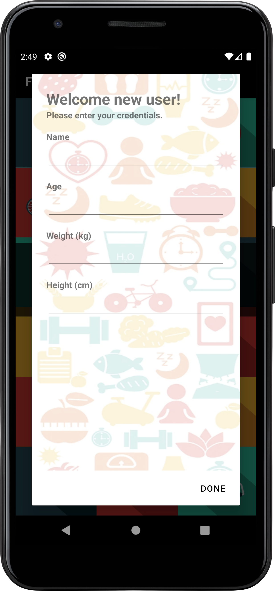
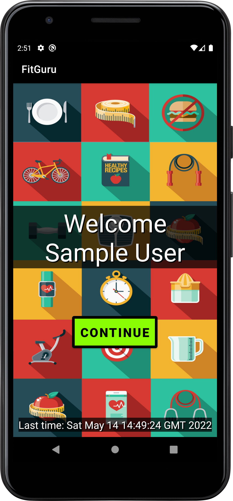

# FitGuru_android
Az alkalmazás egy edzésterv szervező és egészséges táplálkozást segítő alkalmazás. A felhasználónak lehetősége van saját edzéstervet készítenie különböző gyakorlattípusokból. Az alkalmazást használva könnyen nyomon követheti a gyakorlatokat edzés közben. A felhasználó számontarthatja a teljesítéseit, így az edzés dinamikusabbá, eredményesebbé válhat, továbbá lekérdezheti az aktuálisan fogyasztott ételek tulajdonságait.

## Felhasználói kézikönyv

Az alkalmazás telepítése után az első indítás esetén egy dialógus ablakban a felhasználónak meg kell
adnia az adatait. Az alkalmazás használatához kötelező legalább elfogadni a „DONE” segítségével,
hogy beléphessünk az alkalmazásba. Üres adatok esetén a felhasználónév „User” a többi adat 0,
amely később megváltoztatható.

Amennyiben nem először indítjuk az alkalmazást, már bevittük adatainkat, akkor az alkalmazás egy
név szerinti üdvözlő üzenettel fogad minket és kiírja a kijelző alján, hogy mikor indítottük el az
alkalmazást legutóbb.

         
> A bal oldalon az első indítás, a jobb oldalon az általános látható

A „CONTINUE” gombra kattintva belépünk a főmenübe, amely összesen négy menüpontból áll. Ezek
sorra a „PERSONAL”, „TRAINING”, „HEALTHY DIET” és a „HEALTH TIPS”.

A „PERSONAL” kiválasztásával tekinthetjük meg adatainkat. Ez a menü két komponensből
(fragmentből) áll. A „details” komponensen a felhasználó megnézheti, hogy mennyi az aktuális BMI,
Optimális súly, Testzsírtömeg és Testzsír százalék értéke. Ez alatt egy kördiagram jelzi, hogy az
aktuális súlya mennyire van az optimális súlytól.

Jobbra lapozva jelenik meg a „settings” komponens. Ezen állíthatja be, illetve módosíthatja a
felhasználó az aktuális korát, súlyát, magasságát és hogy mekkora maximális cukor, kalória,
szénhidrát és zsír bevitellel számoljon a program. A változtatásokat a „SAVE” gombbal menthetjük el.

