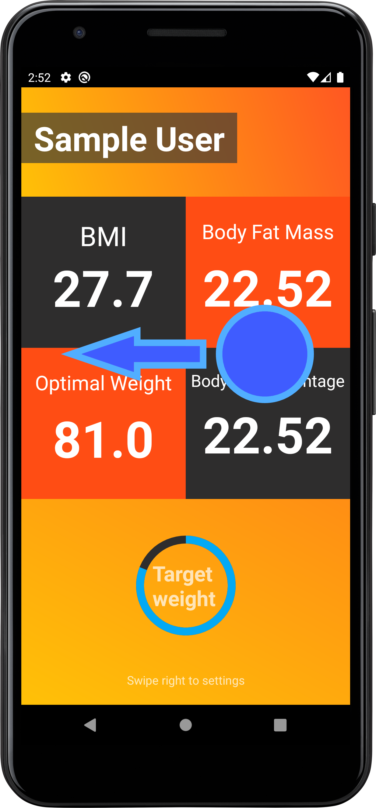

# FitGuru_android
Az alkalmazás egy edzésterv szervező és egészséges táplálkozást segítő alkalmazás. A felhasználónak lehetősége van saját edzéstervet készítenie különböző gyakorlattípusokból. Az alkalmazást használva könnyen nyomon követheti a gyakorlatokat edzés közben. A felhasználó számontarthatja a teljesítéseit, így az edzés dinamikusabbá, eredményesebbé válhat, továbbá lekérdezheti az aktuálisan fogyasztott ételek tulajdonságait. (2022)

## Felhasználói kézikönyv

Az alkalmazás telepítése után az első indítás esetén egy dialógus ablakban a felhasználónak meg kell
adnia az adatait. Az alkalmazás használatához kötelező legalább elfogadni a „DONE” segítségével,
hogy beléphessünk az alkalmazásba. Üres adatok esetén a felhasználónév „User” a többi adat 0,
amely később megváltoztatható.

Amennyiben nem először indítjuk az alkalmazást, már bevittük adatainkat, akkor az alkalmazás egy
név szerinti üdvözlő üzenettel fogad minket és kiírja a kijelző alján, hogy mikor indítottük el az
alkalmazást legutóbb.

         
> A bal oldalon az első indítás, a jobb oldalon az általános látható

A „CONTINUE” gombra kattintva belépünk a főmenübe, amely összesen négy menüpontból áll. Ezek
sorra a „PERSONAL”, „TRAINING”, „HEALTHY DIET” és a „HEALTH TIPS”.

A „PERSONAL” kiválasztásával tekinthetjük meg adatainkat. Ez a menü két komponensből
(fragmentből) áll. A „details” komponensen a felhasználó megnézheti, hogy mennyi az aktuális BMI,
Optimális súly, Testzsírtömeg és Testzsír százalék értéke. Ez alatt egy kördiagram jelzi, hogy az
aktuális súlya mennyire van az optimális súlytól.

Jobbra lapozva jelenik meg a „settings” komponens. Ezen állíthatja be, illetve módosíthatja a
felhasználó az aktuális korát, súlyát, magasságát és hogy mekkora maximális cukor, kalória,
szénhidrát és zsír bevitellel számoljon a program. A változtatásokat a „SAVE” gombbal menthetjük el.

         
> Bal oldalon láthatóak az adatok, gesztúrával lapozva pedig a beállítások tekinthetőek meg. A beállításokat fel-lefele lehet görgetni.

A „TRAINING” menüpont az edzésterv összeállító funkció. A plusz jelre kattintva megjelenik egy
ablak, ahol a felhasználó felvehet egy új gyakorlatot. Megadhatja a gyakorlat típusát: bemelegítés,
normál gyakorlat, nyújtás. Megadhatja a gyakorlat nevét, az ismétlésszámot és a pihenőidőt. A még
el nem végzett gyakorlatok sárga színűek az elvégzettek zöldek.

A gyakorlat elemen lévő piros X segítségével lehet gyakorlatot kitörölni és a zöld pipa segítségével
pedig késznek nyilvánítani. A kijelző alján lévő progress bar az elvégzett és az elvégzésre váró
gyakorlatok arányát mutatja folyamatosan változva.

         
> Bal oldalon látható az új elem felvételi ablak, a jobb oldalon pedig a gyakorlat elemek a progress barral.

A „HEALTHY DIET” funkció szintén két komponensből áll. Az első komponensen vihet be a felhasználó
ételeket. A szövegesen beírt ételek megadhatóak darabszámmal, súllyal, stb.
(további részletek: calorieninjas.com)

Az „OK” gomb hatására az alkalmazás lekérdezi egy API segítségével a megadott étel vagy ételek
összes cukor, kalória, szénhidrát, zsírtartalmát. Ez megjelenik egy felugró dialógus ablakban. Ha a
felhasználó csak ellenőrzésképpen kérte le az adatokat, a „CANCEL” gombbal bezárhatjuk az ablakot
mindenféle hatás nélkül. Ha viszont hozzá szeretné adnia az értékeket a már elfogyasztottakhoz, azt
az „ADD” gombbal teheti meg.

Jobra lapozva tekinthetőek meg a diagrammok, amelyek a már bevitt cukor, kalória, szénhidrát, zsír
mennyiségeket jelenítik meg a beállított maximális érték arányában. Ha a maximális érték meg lett
haladva az érték pirossal lesz kijelezve.

A százalékértékre kattintva válthatunk a százalékos és az érték pontos megjelenítés között. A kuka
ikonra kattintva nullázzuk az aktuális értékeket.

         
> Bal oldalon látható az új elem felvételi ablak, a jobb oldalon pedig a gyakorlat elemek a progress barral

Az utolsó „HEALTH TIPPS” menüben egy weboldal töltődik be, amelyen a felhasználó egészséges
recepteket keresgélhet. (bbcgoodfood.com/recipes/category/all-healthy)

         
> Bal oldalon látható az egészséges receptek weboldal megjelenítése, jobb oldalon a főmenü látszódik

## Főbb felhasznált technológiák

- Egyedi View/drawable elemek
- Fragmentek használata, lapozás a fragmentek között
- Fragment Dialogok használata az egyedi látványosabb dialógus ablakokhoz
- Progress Bar használata a látványos megjelenítéshez
- CalorieNinjas API használata, REST végponton adatletöltés
- JSONObject az API válaszának feldolgozásához
- Room alapú adattárolás
- Shared Preferences alapú adattárolás
- RecyclerView az egyedi kinézetű edzésterv listához
- WebView a receptes weblap megjelenítéséhez
